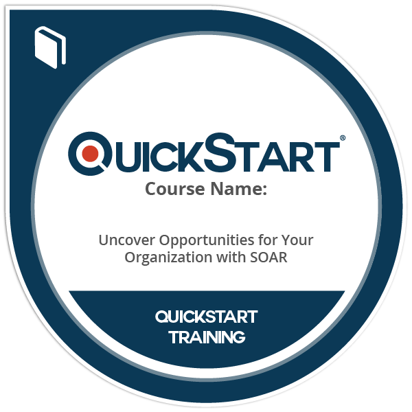

<h1>Hi, I'm Gerardo, an IT Professional.

<h2 style="margin-bottom: 5px;">Technical Achievements, Certs & Badges</h4>

<table>
  <tr>
    <td valign="top" align="center">
      
       
      <a href=https://github.com/Jmad1k/Jmad1k/blob/main/IT%20Technician%20Bootcamp_Certificate.pdf style="font-size: 11px; font-weight: normal;">View Certificate</a>
    </td>
    <td valign="top" align="center">
      
    </td>
  </tr>
</table>

<h2>👨‍💻 Information Technology Projects:</h2>

- <b>osTicket (Help Desk Ticketing System)</b>
  - [osTicket: Prerequisites and Installation](https://github.com/Jmad1k/osticket-prereqs)
  - [osTicket: Post-Installation Configuration](https://github.com/Jmad1k/post-install-config)
  - [osTicket: Ticket Lifecycle Examples](https://github.com/Jmad1k/ticket-lifecycle)
- <b>Microsoft Azure</b>
  - [Configuring On-premises Active Directory within Azure VMs](https://github.com/Jmad1k/configure-ad)
  - [Network Security Groups (NSGs) and Inspecting Network Protocols](https://github.com/Jmad1k/azure-network-protocols)

